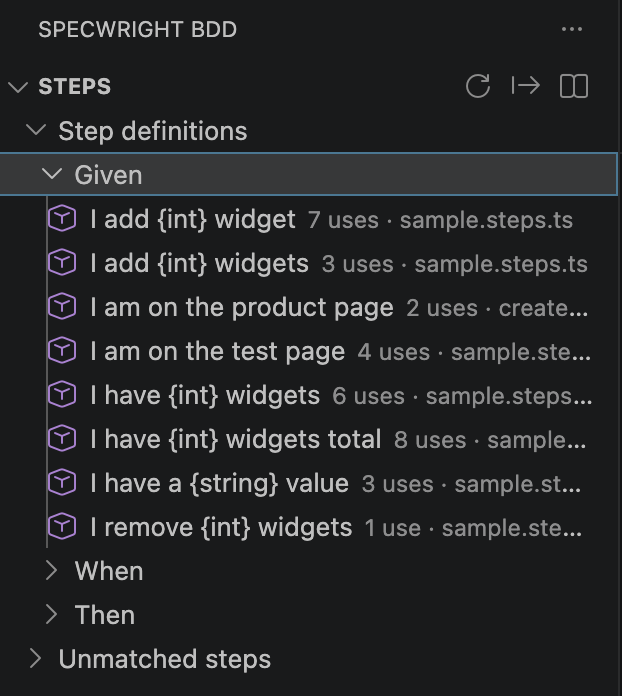

# Author feature files and manage steps

Specwright adds Gherkin authoring tools to `.feature` files and connects them to the `playwright-bdd` step definitions in your workspace. Most features work as you type and update when feature or step files change.

## Write feature files

### Syntax, outline, and snippets

Gherkin syntax highlighting is built in, so no second extension is required. The VS Code breadcrumb bar and Outline view recognise Features, Rules, Backgrounds, Scenarios, Scenario Outlines, and singular `Example:` scenarios.

Use these snippets in a `.feature` file:

| Prefix | Inserts |
| --- | --- |
| `feat` | A Feature with a user-story preamble and first scenario. |
| `scen` | A Scenario with Given, When, and Then steps. |
| `bg` | A Background block. |
| `outline` | A Scenario Outline with an Examples table. |
| `ex` | An Examples block. |
| `rule` | A Rule with an Example. |

### Complete tags and steps

Type `@` to suggest tags already used in feature files across the workspace. Type a step keyword such as `Given`, `When`, `Then`, `And`, `But`, or `*` to suggest matching step definitions from your configured step paths.

Step suggestions insert parameters as snippets so you can use `Tab` to fill them in. The feature supports plain-string, template-literal, regular-expression, and Cucumber-expression definitions.

### Format data tables

Run **Format Document** on a `.feature` file to align pipes in step data tables and Examples tables. Columns containing only numbers are right-aligned. Configure this with `playwrightBddRunner.enableTableFormatting`.

## Understand and fix diagnostics

### Missing steps

An unmatched Gherkin step receives a red diagnostic. Choose the lightbulb and select **Create Step Definition** to generate a typed stub for that step. You can also generate definitions for every missing step in the active feature file.

<!-- Screenshot placeholder: ../images/missing-step-quick-fix.png
Show an unmatched-step diagnostic in a .feature file and the Create Step Definition Code Action. -->

### Ambiguous steps

If a step matches more than one definition, Specwright shows a warning before the test can fail at runtime. The lightbulb provides a link to each conflicting definition.

### Scenario Outline validation

Specwright warns when a step references a placeholder that has no matching Examples column. It also marks an Examples column that no step uses. These checks make outline errors visible before a test run.

`playwrightBddRunner.enableStepDiagnostics` controls all three diagnostic types.

## Navigate and maintain step definitions

### Go to Definition and hover

Use `Cmd+Click` on macOS or `Ctrl+Click` on Windows and Linux to open the matching `Given`, `When`, or `Then` definition. Hover over a step to see its pattern and a link to the source file. If more than one definition matches, the hover lists every match.

### Find references and usage counts

From a step definition, use VS Code's **Find All References** to list matching Gherkin steps in the workspace. A `Used N times` CodeLens above a definition opens the same result. Definitions with no matching feature steps receive an information diagnostic when unused-step diagnostics are enabled.

### Promote a literal to a parameter

Place the cursor on a hard-coded string, integer, or decimal in a Gherkin step and use the Code Action lightbulb. **Promote literal** updates the feature step and its matching definition together, replacing the literal with the appropriate Cucumber-expression parameter:

| Literal | Parameter |
| --- | --- |
| `"Ada"` | `{string}` |
| `42` | `{int}` |
| `3.14` | `{float}` |

Use this refactor when a one-off step needs to become reusable without manually changing two files.

## Generate step definitions

Choose **Specwright: Generate Missing Step Definitions** to scan the active feature file and create typed stubs for every unmatched step. You can add them to an existing step file or create a new one. Running the command again adds only steps that are still unmatched.

Parameter values are inferred where possible:

| Scenario text | Generated pattern |
| --- | --- |
| `I sign in as "Ada"` | `I sign in as {string}` |
| `I have 5 items` | `I have {int} items` |
| `the price is 3.14` | `the price is {float}` |

## Steps panel

Open the **Specwright** container in the Activity Bar and select **Steps**. The panel is useful when a project has more step definitions than are practical to manage file by file.

It provides:

- Definitions grouped by `Given`, `When`, and `Then`, including usage counts and unused markers.
- Unmatched steps grouped by feature file.
- One-click generation for a single unmatched step or every missing step in a file.
- **Insert Step…**, which inserts a known step pattern into the active feature file as a snippet.
- **Export Steps** and **Export All Scenarios**, which write Markdown catalogs for sharing or review.

Set `playwrightBddRunner.enableStepsPanel` to `false` to hide the panel.

### Export catalogs

Step catalogs include a summary, table of contents, linked sections, and an unused-step callout. Scenario catalogs can cover all features, a tag, or selected feature files, and include a browse-by-tag index. Set `playwrightBddRunner.collapseMarkdownExportSections` to start large exported sections collapsed.

## Use alongside Cucumber (Gherkin) Full Support

Specwright detects [Cucumber (Gherkin) Full Support](https://marketplace.visualstudio.com/items?itemName=alexkrechik.cucumberautocomplete) and, by default, steps aside for overlapping features such as autocomplete, hover, references, usage CodeLens, unused-step diagnostics, literal promotion, and table formatting.

Set the relevant compatibility-mode setting to:

- `auto` to avoid duplicates when the other extension is installed.
- `on` to keep both extensions active.
- `off` to disable the Specwright feature.

See [Settings](settings.md#compatibility-mode-settings) for the complete list.

## Xray traceability

The separate **Traceability** panel is for experimental Xray Cloud workflows, including tagged-scenario coverage, sync, the Coverage Board, and local-run publishing. See [Xray traceability](traceability.md) for setup and for a clear explanation of local, read-only, and remote-write actions.

## Next steps

- [Run and debug tests](runs.md)
- [Configure step discovery and authoring features](settings.md#step-discovery-and-authoring-settings)
- [Troubleshoot missing, ambiguous, or unavailable step features](troubleshooting.md)
