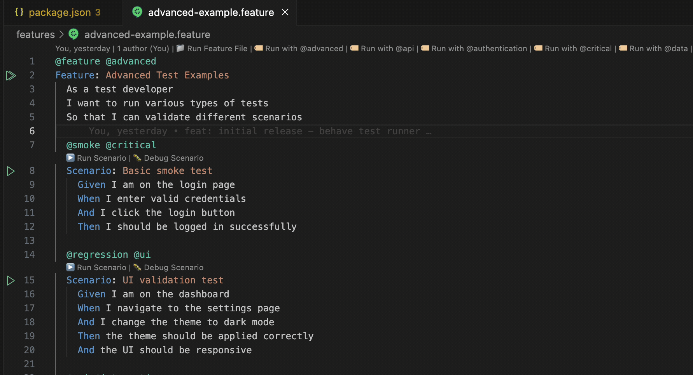
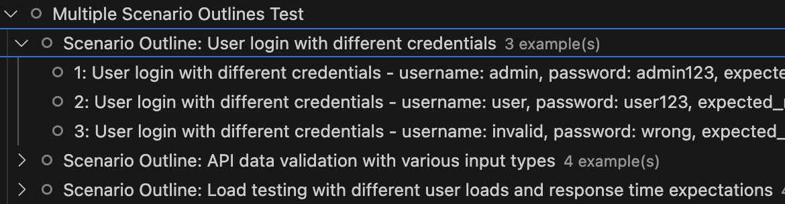
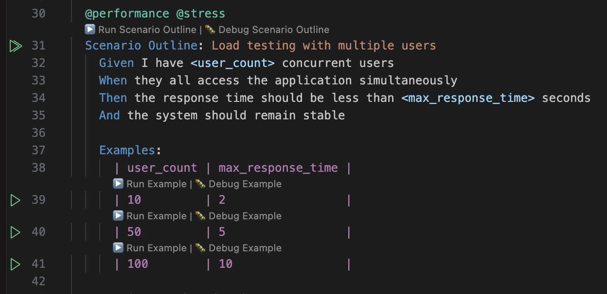
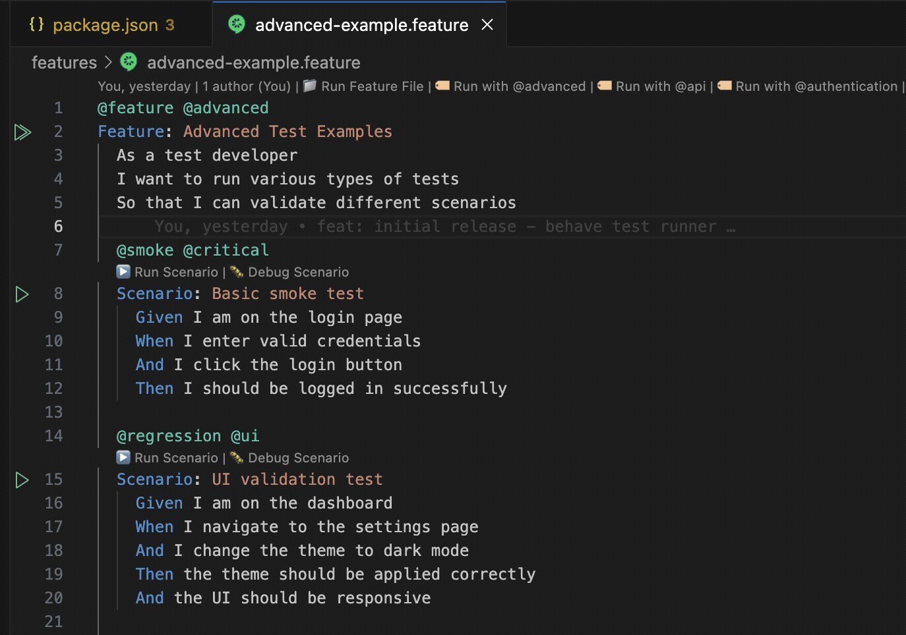
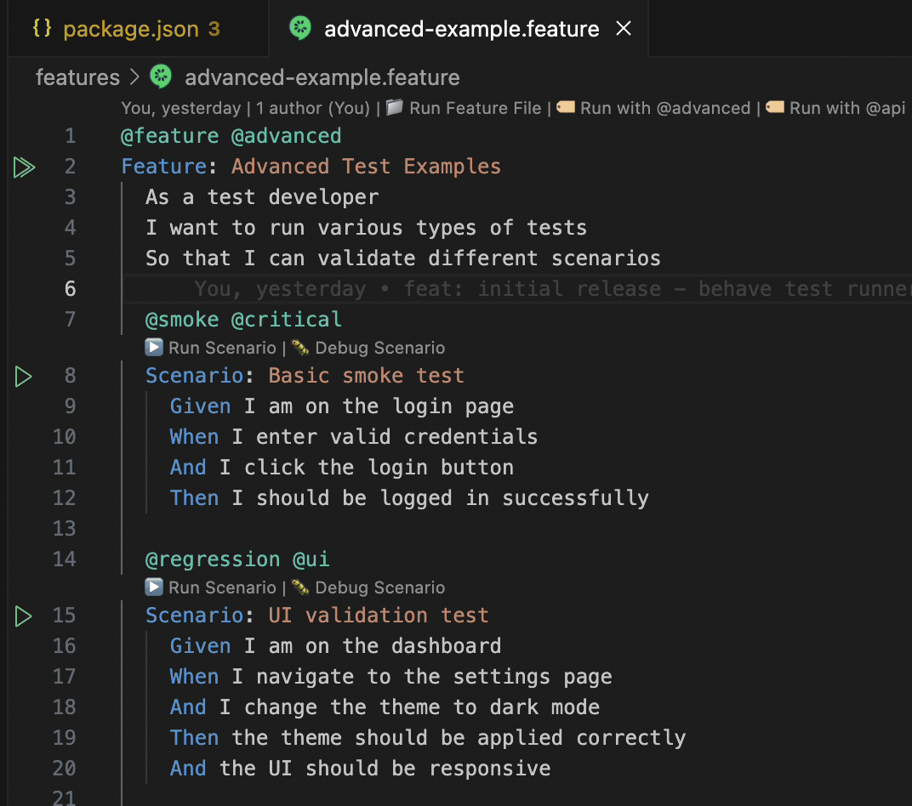

# Running tests

## Prerequisites

The extension assumes a Node-based project that already has playwright-bdd configured:

```bash
npm i -D @playwright/test playwright-bdd
npx playwright install
```

A minimal `playwright.config.ts`:

```ts
import { defineConfig } from "@playwright/test";
import { defineBddConfig } from "playwright-bdd";

const testDir = defineBddConfig({
  features: "features/**/*.feature",
  steps: ["features/steps/**/*.ts"],
});

export default defineConfig({ testDir });
```

See [playwright.config.ts](../playwright.config.ts), [features/test.feature](../features/test.feature), and [features/steps/sample.steps.ts](../features/steps/sample.steps.ts) in this repo for a working example.

## How runs are dispatched

Targeting any scenario from the Test Explorer or CodeLens runs a shell command of the form:

```
[<preRunCommand> &&] npx bddgen [--tags "<expr>"] && npx playwright test [--grep "<scenario>"] [--workers=N] [--list] [--reporter=…]
```

- **Pre-run hook.** When `playwrightBddRunner.preRunCommand` is set, the extension runs it before every Playwright invocation. A non-zero exit aborts the run and writes the captured stderr to the test output channel; nothing is sent to Playwright.
- **Tag filtering** is pushed into `bddgen --tags` so only matching specs are generated.
- **Scenario selection** uses `--grep` against the scenario name (Playwright doesn't support `.feature`-line addressing). A whole-Scenario-Outline run greps the outline name so every expanded example row is included.
- **Feature-file selection** greps by the `Feature:` title (not the filename), so running one feature can't accidentally match another feature whose scenario titles happen to contain the filename.
- **Result mapping** back to the Test Explorer reads the Playwright JSON reporter — the extension appends `--reporter=json` alongside whatever reporter you configured so the user-visible output isn't disturbed. Because playwright-bdd's report carries no `.feature` source line, the extension reads the `bddFileData` block embedded in each generated spec to map every result (including `Example #N` outline rows, which the report only labels by index) back to its exact `.feature` path and line. So status sticks to the right tree item even without source annotations.
- **`bddgen` failures** are parsed for `feature_file:line` markers and republished as `Error`-severity diagnostics on the offending `.feature` line (source `Playwright-BDD`, code `bddgen-error`). These diagnostics clear automatically on the next successful run.
- **Parallel execution** appends `--workers=<maxParallelProcesses>` when `playwrightBddRunner.parallelExecution` is `true`. The "Run in Parallel" Test Explorer profile also forces this flag, independent of that setting. On first use in a workspace the profile prompts for a worker count (1 / 2 / 4 / 8 / 16 / Custom) and persists the choice to `playwrightBddRunner.maxParallelProcesses`; subsequent runs use the stored value silently. If `maxParallelProcesses` is ever invalid, the profile auto-adjusts to `CPU cores - 2` (clamped to 1–16).
- If your `playwright.config.ts` already runs `bddgen` automatically (via `defineBddProject`), set `playwrightBddRunner.bddgenCommand` to an empty string to skip the explicit codegen step.

## Test Explorer

Scenarios appear in the Testing view — open it from the Activity Bar (it has no default keybinding) — grouped by your chosen organization strategy. A `FileSystemWatcher` refreshes the tree on `.feature` create/change/delete.



The tree can be regrouped on the fly via the per-test-item context menu or the organization commands:


### Run profiles

The Test Explorer Run-button dropdown exposes three profiles:
- **Run** (default) — sequential Playwright invocation.
- **Debug** — runs the targeted command under VS Code's JS debugger (a `node-terminal` launch), so breakpoints in your step-definition `.ts` files are hit. It deliberately does *not* use Playwright's `--debug` Inspector.
- **Run in Parallel** — forces `--workers=N` on the spawned Playwright command regardless of the `playwrightBddRunner.parallelExecution` setting. First use prompts for a worker count and persists it.

### Scenario Outline rows

Each row of every `Examples:` block is discovered as its own runnable item named `<index>: <outline name> - <header>: <value>, …`. Both Test Explorer and `--grep` can address rows individually.




## CodeLens

Implemented in [src/parsers/feature-parser.ts](../src/parsers/feature-parser.ts) (`provideScenarioCodeLenses`). Four kinds of CodeLens render in a `.feature` editor when `playwrightBddRunner.enableCodeLens` is `true`:

- **Feature-level**, anchored to the `Feature:` line: "Run Feature File", plus one "Run with @tag" link for every unique tag found anywhere in the file.
- **Scenario-level**, above each `Scenario:`: "Run Scenario" and "Debug Scenario".
- **Scenario Outline-level**, above each `Scenario Outline:`: "Run Scenario Outline" and "Debug Scenario Outline".
- **Example-level**, above each row inside an `Examples:` block: "Run Example" and "Debug Example", scoped to that single row.



## Status bar

A status bar item on the left shows the current run state:

- `Playwright-BDD` when idle.
- `Playwright-BDD: running…` while a Playwright invocation is in flight.
- `Playwright-BDD: passed N` or `Playwright-BDD: N passed, M failed` after the last run, until the next one starts.

Clicking the item focuses the test output channel (`Specwright: Show Test Output`). The item is always visible — there is no setting to hide it. Use VS Code's standard status bar controls to suppress it if needed.

## Test Results output

After a run, the Test Explorer's **Test Results** panel shows a per-scenario summary rendered from the parsed report (rather than the raw JSON reporter payload):

- Each scenario heading, then its Gherkin steps with durations — **green** for passed steps, **red** for the failed one. Scenario Outline examples render as `Scenario Outline: <name> — Example #N` with the example values already substituted into the step text, so you can see exactly which inputs passed or failed.
- For a failure, the step that failed is followed by the `.feature` location, the error message, and the raw stack frames (left intact so the panel turns `file:line:col` into clickable links into the failing step-definition code). The same error + stack is attached to the failing item, so it also shows inline and in the failure peek.
- **Missing step definitions.** When `missingSteps: "skip-scenario"` causes bddgen to skip scenarios, its `Missing step definitions:` block (with the suggested step snippets) is surfaced here too, followed by a pointer to the *Generate Missing Step Definitions* command.
- **Out-of-scope features.** If a run produces no results for the feature you targeted — e.g. the `.feature` lives outside playwright-bdd's configured `features` glob, so bddgen never generates it — the panel flags it and suggests the glob to add to `defineBddConfig({ features: [...] })`, rather than silently leaving the items skipped.

## Commands

All command IDs use the `playwrightBddRunner.*` prefix. In the command palette they appear under the **Specwright** category.

### Discovery and tree

- `discoverTests` — scan the workspace for `.feature` files.
- `refreshTests` — re-read the cache and rebuild the Test Explorer tree.

### Running and debugging

- `runAllTests` / `runAllTestsParallel`
- `runFeatureFile` / `runFeatureFileWithTags`
- `runScenario` / `debugScenario` / `runScenarioWithTags`

### Context-menu variants

These take their target from the arguments the invoking surface passes in (file Uri, and for CodeLens a line number and scenario name); bound to the editor and editor-title menus. When the menu passes only the Uri, they run the whole feature file.

- `runScenarioWithContext` / `debugScenarioWithContext`
- `runFeatureFileWithContext`

### Navigation

- `goToStepDefinition` — jump from the Gherkin step under the cursor to its matching step definition. Also available in the `.feature` editor context menu.

### Organization

- `setOrganizationStrategy` — pick a strategy from a quick-pick.
- `setTagBasedOrganization` / `setFileBasedOrganization` / `setScenarioTypeOrganization` / `setFlatOrganization` / `setFeatureBasedOrganization` — direct shortcuts, exposed via the Test Explorer item submenu.
- `debugOrganization` — log the current strategy and grouping to the output channel.

### Code generation

- `generateStepDefinitions` — scan the active `.feature` file for unmatched steps and insert typed stubs into a chosen step file. See [features.md → step-definition generation](features.md#step-definition-generation).

### Diagnostics

- `showOutput` — focus the extension's output channel.
- `validateConfiguration` — validate the current `playwrightBddRunner.*` settings and report problems.

## Context menus

The extension registers entries in four VS Code menus (see `contributes.menus` in [package.json](../package.json)):

- **Editor context** (right-click inside a `.feature` editor): Run Scenario, Debug Scenario, Run Feature File, Go to Step Definition, Generate Missing Step Definitions. The run/debug entries receive the file Uri from the menu and run the whole feature file.
- **Editor title context** (right-click a `.feature` editor tab): Run Feature File, Run All Tests, Refresh Tests.
- **Explorer context** (right-click a `.feature` file in the file explorer): Run Feature File, Run All Tests, Refresh Tests.
- **Test Explorer item context** (right-click a test item): an "Organization Strategy" submenu exposing the five organization shortcuts.

The Test Explorer view context also includes a Discover Tests entry.



## Known limitations

- Playwright doesn't support `--grep` by file:line, so the extension targets scenarios by name and features by `Feature:` title. Two scenarios sharing a name in the same project will both run, and two features sharing a title would collide.
- Result-to-line mapping reads the generated spec's `bddFileData` (resolved via the report's `config.rootDir`). If a run fails *before* codegen produces specs, there's nothing to read and mapping falls back to name matching for that run.
- A few details depend on playwright-bdd's exact output — the `bddFileData` shape, the `Missing step definitions:` wording, and Playwright's "no tests found" message. A major playwright-bdd/Playwright upgrade could change these; the [debug-test-mapping](../.claude/skills/debug-test-mapping/SKILL.md) skill covers re-diagnosing if mapping regresses.
