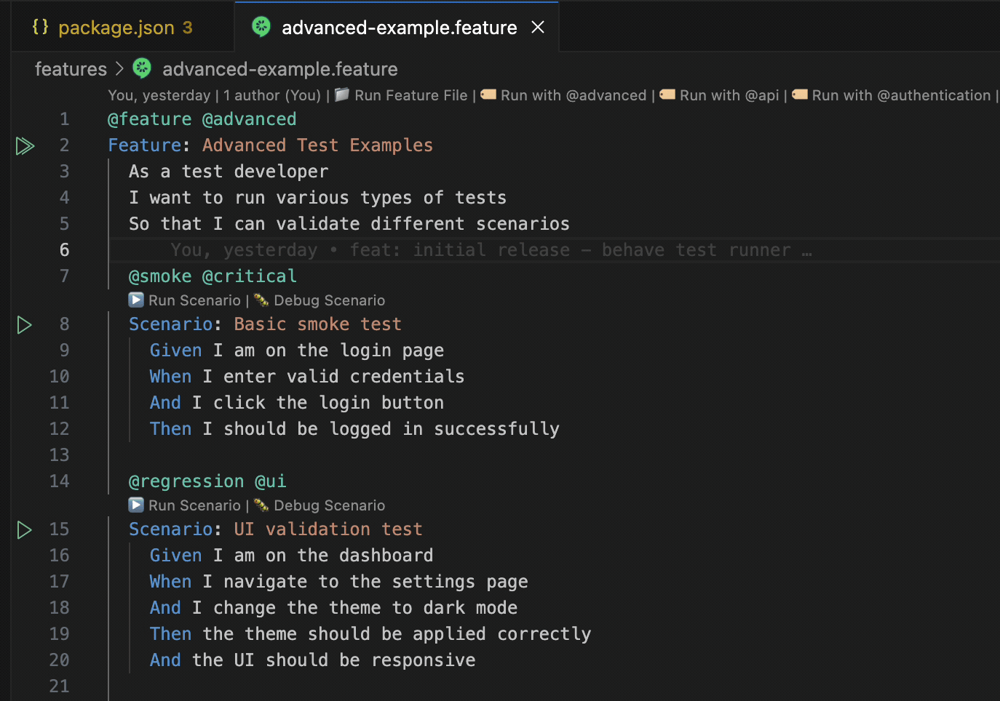
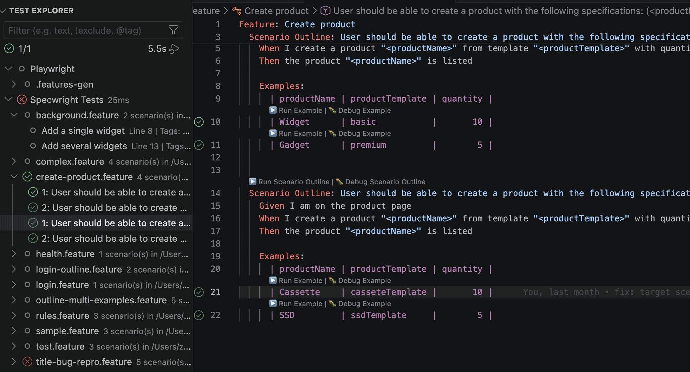

# Run and debug tests

Specwright discovers `.feature` files and presents their scenarios in VS Code's **Testing** view. You can run or debug the whole workspace, one feature, one scenario, a Scenario Outline, or one Examples row.

## Before you run

Your workspace needs a working [`playwright-bdd`](https://vitalets.github.io/playwright-bdd/) and Playwright configuration. Specwright runs the configured `bddgen` command before Playwright unless you have disabled it because your Playwright configuration already performs code generation.

If the Testing view is empty, start with [Troubleshooting: features do not appear in Testing](troubleshooting.md#features-do-not-appear-in-testing).

## Choose where to run from

| Where you are working | What you can do |
| --- | --- |
| **Testing** view | Run, debug, stop, or inspect features, scenarios, outlines, and Examples rows. |
| **Feature editor** | Use CodeLens above a feature, scenario, outline, or Examples row. |
| **Editor and Explorer context menus** | Choose **Run Feature File** or other file-level actions. Use CodeLens or the Testing view to select an individual scenario or Examples row. |
| **Command Palette** | Use commands under the **Specwright** category, with a `.feature` file open. |

## Run a test

1. Open the **Testing** view.
2. Expand a feature until you reach the scope you want to run.
3. Select the **Run** icon, or use the action in the feature editor.

Specwright creates the required specs, starts Playwright, and maps each scenario result to the item you selected as soon as it finishes. During a long run, the Test Results output and status bar show the live completed count. Editor-triggered feature and scenario runs show the same count in a progress notification. The final JSON report reconciles the complete result and supplies the detailed summary after Playwright exits. Select the status bar item to open the Specwright output channel.

### Run one Scenario Outline row

Each Examples row is a first-class item in the Testing view and receives its own CodeLens actions. Choose **Run Example** or **Debug Example** above that row to target it. Code generation still runs when the project requires it, but Specwright targets the matching row and reports the outcome there.

### Run by tag

Use **Run with @tag** above a feature, or configure a default tag expression with `playwrightBddRunner.tags`. The expression is passed to `bddgen`, so only matching specs are generated.

### Run in parallel

Choose **Run All Tests in Parallel** from the Testing view, or from the Command Palette with a `.feature` file open. The first run asks for a worker count and remembers it. You can also enable workers through `playwrightBddRunner.parallelExecution` and set `playwrightBddRunner.maxParallelProcesses`.

The worker count controls concurrency that Playwright permits across files and projects. A feature normally generates one spec file, so hundreds of scenarios in that one feature do not become parallel solely because Specwright passes `--workers`. Use Playwright's `fullyParallel` configuration when you deliberately want tests within one generated file to run in parallel.

### Run a pre-flight command

Set `playwrightBddRunner.preRunCommand` when a build, fixture setup, or other local task must succeed before every test run. A failing pre-run command stops the test run and writes its output to the Specwright channel.

## Organize the Testing view

Use **Set Organization Strategy** to switch among:

- Hierarchical by feature
- By tag
- By file
- By scenario type
- Flat

The selection changes only the Testing view. It does not move or modify feature files.

## Debug with breakpoints

Set a breakpoint in a `.feature` file or TypeScript/JavaScript step definition, then choose a **Debug** action.

When you debug a feature-file breakpoint, Specwright:

1. Runs `bddgen` so generated specs are available.
2. Finds the generated line that corresponds to supported Gherkin steps, scenarios, and Examples rows.
3. Mirrors the breakpoint to that generated spec and starts VS Code's JavaScript debugger.
4. Removes the mirrored breakpoint when the debug session ends.

The debugger pauses in the generated specification, or in your step definition after you step in, rather than in the `.feature` file. This is expected: the JavaScript debugger can bind only to executable JavaScript.

If your project writes generated specs outside `.features-gen`, set `playwrightBddRunner.featuresGenDir` to the matching directory. Step-definition breakpoints still work if a feature-file breakpoint cannot be mapped.

## Read results

While a run is active, the **Test Results** panel streams Playwright and `bddgen` output, marks each completed scenario, and writes lines such as `[127 / 500]`. After the run, it shows the final scenario summary with Gherkin steps, durations, failures, and clickable stack traces.

Specwright keeps only the newest 256 KiB from stdout and stderr as diagnostic tails. The full process output still streams to Test Results. If a tail is truncated, a notice reports its retained and discarded byte counts. A Playwright JSON report larger than 16 MiB, or an inline report attachment larger than 1 MiB after base64 decoding, stops result ingestion with a specific size-limit message. File-based evidence paths are unaffected.

<!-- Screenshot placeholder: ../images/test-results.png
Show VS Code Test Results for one failed scenario, including a failing Gherkin step and a clickable stack trace. Remove sensitive paths and data. -->

- A retry that eventually passes is reported as passed.
- If the same scenario runs in multiple Playwright projects, the least successful result is shown.
- Missing step-definition suggestions are surfaced when `bddgen` skips scenarios for missing steps.
- If a feature is outside your `playwright-bdd` `features` glob, Specwright explains why the targeted run produced no result.

## Stop a run

Use VS Code's **Stop** action in the Testing view. For a feature or scenario run started from CodeLens or an editor menu, use **Cancel** in its progress notification. Specwright ends the Playwright process tree and marks tests that did not run as skipped. A deliberately stopped run is shown as cancelled, not failed. A debug run stops the same way, and its debug session ends with it.

## Commands

All commands appear under **Specwright** in the Command Palette. The run, discovery, and step commands are listed there with a `.feature` file open.

| Task | Commands |
| --- | --- |
| Discover or refresh tests | **Discover Tests**, **Refresh Tests** |
| Run tests | **Run All Tests**, **Run All Tests in Parallel**, **Run Feature File**, **Run Scenario**, **Run Scenario with Tags**, **Run Feature File with Tags** |
| Debug tests | **Debug Scenario** |
| Change the Testing view | **Set Organization Strategy**, **Organize by Tags**, **Organize by File**, **Organize by Scenario Type**, **Flat Organization**, **Hierarchical Organization** |
| Inspect the extension | **Show Test Output**, **Validate Configuration** |

Some commands take their target from the menu or CodeLens item that launched them. The Testing view and CodeLens are the clearest way to choose an individual scenario or Examples row.

## Limits to be aware of

- Specwright normally targets generated-spec lines. If a generated spec cannot be found or mapped, it falls back to matching by scenario name. Duplicate names can then run together, and an outline fallback can run all of its rows.
- A breakpoint on a shared Background step pauses once for every scenario that executes that step.
- Code generation and result mapping depend on the output format emitted by your installed `playwright-bdd` and Playwright versions.

## Next steps

- [Configure commands, reports, tags, workers, and output directories](settings.md#run-and-discovery-settings)
- [Write and maintain feature files](features.md)
- [Troubleshoot runs and debugging](troubleshooting.md)
