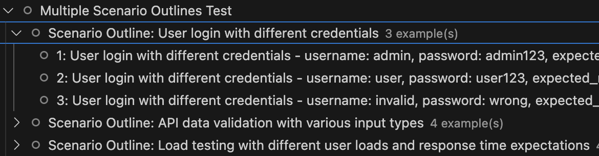

# Running tests

## Prerequisites

The extension assumes a Node-based project that already has playwright-bdd configured:

```bash
npm i -D @playwright/test playwright-bdd
npx playwright install
```

A minimal `playwright.config.ts`:

```ts
import { defineConfig } from "@playwright/test";
import { defineBddConfig } from "playwright-bdd";

const testDir = defineBddConfig({
  features: "features/**/*.feature",
  steps: ["features/steps/**/*.ts"],
});

export default defineConfig({ testDir });
```

See [playwright.config.ts](../playwright.config.ts), [features/test.feature](../features/test.feature), and [features/steps/sample.steps.ts](../features/steps/sample.steps.ts) in this repo for a working example.

## How runs are dispatched

Targeting a scenario from the Test Explorer or CodeLens runs a shell command of the form:

```
[<preRunCommand> &&] npx bddgen [--tags "<expr>"] && npx playwright test [<generated-spec>:<line> | --grep "<scenario>"] [--workers=N] [--list] [--reporter=…]
```

- **Pre-run hook.** When `playwrightBddRunner.preRunCommand` is set, the extension runs it before every Playwright invocation. A non-zero exit aborts the run and writes the captured stderr to the test output channel; nothing is sent to Playwright.
- **Tag filtering** is pushed into `bddgen --tags` so only matching specs are generated.
- **Precise scenario selection.** After `bddgen` runs, Specwright reads the generated spec's source map and, when possible, calls Playwright with `<generated-spec>:<line>`. This is what lets one Scenario Outline example row run by itself. Paths use forward slashes on every platform so Windows paths remain valid Playwright filters. If a generated spec or line cannot be resolved, Specwright falls back to a name-based `--grep` and reports the fallback in the output channel; an outline fallback runs every row in that outline.
- **Feature-file selection** greps by the `Feature:` title (not the filename), so running one feature can't accidentally match another feature whose scenario titles happen to contain the filename.
- **Result mapping** back to the Test Explorer reads the Playwright JSON reporter — the extension appends `--reporter=json` alongside whatever reporter you configured so the user-visible output isn't disturbed. Because playwright-bdd's report carries no `.feature` source line, the extension reads the `bddFileData` block embedded in each generated spec to map every result (including `Example #N` outline rows, which the report only labels by index) back to its exact `.feature` path and line. So status sticks to the right tree item even without source annotations.
- **`bddgen` failures** are parsed for `feature_file:line` markers and republished as `Error`-severity diagnostics on the offending `.feature` line (source `Playwright-BDD`, code `bddgen-error`). These diagnostics clear automatically on the next successful run. When codegen is delegated to `defineBddProject` (so `bddgen` runs inside `playwright test` rather than as a separate step), those generation errors reach the Problems panel too.
- **Missing binaries** produce an actionable hint. If `npx`, `playwright`, or `bddgen` isn't found (a `command not found` / `is not recognized` shell error), the failure names the binary and points at installing the project's dependencies, instead of surfacing only raw shell noise.
- **Runs that produce no per-scenario results** fail the targeted item rather than hide the failure. When a run fails before any scenario result exists — a bddgen or compile error — the feature/outline/tag parent is marked failed (its children stay skipped), except for the deliberate "no tests found" out-of-scope case, which stays explained as skipped (see [Test Results output](#test-results-output)).
- **Debug runs split the command.** Instead of chaining everything with `&&`, the executor runs `bddgen` as a separate step first — so the generated specs exist before feature-file breakpoints are mirrored into them — and then launches only the `playwright test` half under the debugger. See [Debugging with breakpoints](#debugging-with-breakpoints).
- **Parallel execution** appends `--workers=<maxParallelProcesses>` when `playwrightBddRunner.parallelExecution` is `true`. The "Run in Parallel" Test Explorer profile also forces this flag, independent of that setting. On first use in a workspace the profile prompts for a worker count (1 / 2 / 4 / 8 / 16 / Custom) and persists the choice to `playwrightBddRunner.maxParallelProcesses`; subsequent runs use the stored value silently. If `maxParallelProcesses` is ever invalid, the profile auto-adjusts to `CPU cores - 2` (clamped to 1–16).
- If your `playwright.config.ts` already runs `bddgen` automatically (via `defineBddProject`), set `playwrightBddRunner.bddgenCommand` to an empty string to skip the explicit codegen step.

## Test Explorer

Scenarios appear in the Testing view — open it from the Activity Bar (it has no default keybinding) — grouped by your chosen organization strategy. A `FileSystemWatcher` refreshes the tree on `.feature` create/change/delete.


The tree can be regrouped on the fly via the per-test-item context menu or the organization commands:


### Run profiles

The Test Explorer Run-button dropdown exposes three profiles:
- **Run** (default) — sequential Playwright invocation.
- **Debug** — runs `bddgen` first, mirrors any `.feature`-file breakpoints onto the generated spec, then runs the targeted command under VS Code's JS debugger (a `node-terminal` launch), so breakpoints in `.feature` files and in your step-definition `.ts` files are hit. It deliberately does *not* use Playwright's `--debug` Inspector. See [Debugging with breakpoints](#debugging-with-breakpoints).
- **Run in Parallel** — forces `--workers=N` on the spawned Playwright command regardless of the `playwrightBddRunner.parallelExecution` setting. First use prompts for a worker count and persists it.

### Scenario Outline rows

Each row of every `Examples:` block is discovered as its own runnable item named `<index>: <outline name> - <header>: <value>, …`. Specwright resolves the corresponding generated-test line so a row can run or debug independently, even immediately after the feature has been edited. If the generated mapping is unavailable, it clearly warns before falling back to an outline-name run, which includes every row.




<!-- Media placeholder: add images/scenario-outline-single-row.gif when replacing or supplementing the GIF above.
Show one Examples row selected, one browser/test execution, and only that row receiving the result. -->

### Cancelling a run

The Test Explorer stop button cancels the run. The extension kills the spawned Playwright process tree (`taskkill /T` on Windows, a process-group `SIGTERM` elsewhere, so a `webServer` or browser child can't outlive the run) and marks any item that hasn't started yet — and its descendants — skipped. The killed subtree is *not* reported as failed, and the status bar settles into its `cancelled` state.

### Durations and flaky runs

After a run, each scenario shows its measured duration in the Test Explorer. Result mapping follows Playwright's own exit code: a test that fails then passes on retry (Playwright's "flaky" case) maps to **passed**, and when the same scenario runs in more than one project (multi-project, `repeat-each`) the worst outcome wins.

## Debugging with breakpoints

Click the gutter in a `.feature` file to set a breakpoint — the extension enables VS Code's breakpoint gutter for Gherkin — then start any Debug action (Debug Scenario / Scenario Outline / Example, or the Test Explorer Debug profile). What happens on launch:

1. `bddgen` runs first, as a separate step, so the generated specs exist before the debugger starts. If codegen fails, the launch is aborted and the error is logged.
2. The extension reads the `bddFileData` block in the generated spec under `playwrightBddRunner.featuresGenDir` (default `.features-gen`) and mirrors each feature-file breakpoint onto the corresponding generated-spec line: steps, `Scenario:` lines, and the `Examples:` rows that playwright-bdd maps. Feature lines with no executable counterpart (comments, tags, the `Feature:` line) are ignored.
3. The Playwright command launches under VS Code's JS debugger (`node-terminal`), which auto-attaches to the spawned Node processes and binds the mirrored breakpoints.
4. When the debug session ends, the mirrored breakpoints are removed, so your breakpoint list only ever contains what you set yourself. Spec lines shared by concurrent sessions (e.g. `Background` steps) are reference-counted and survive until the last session referencing them ends.

Caveats:

- When paused, the editor shows the **generated spec** — or your step definition once you step in — not the `.feature` file. The JS debugger can only bind to real JavaScript.
- A breakpoint on a shared `Background` step pauses for every scenario in the session that executes it, not just the scenario you targeted.
- If your playwright-bdd `outputDir` isn't the default, set `playwrightBddRunner.featuresGenDir` to match. Otherwise the extension can't locate the generated spec and feature-file breakpoints are skipped for that session (step-definition breakpoints still work).

Implemented in [src/core/breakpoint-mirror.ts](../src/core/breakpoint-mirror.ts) and [src/parsers/bdd-file-data-parser.ts](../src/parsers/bdd-file-data-parser.ts).

<!-- Media placeholder: add images/debug-feature-breakpoint.gif here.
Show a Gherkin breakpoint, Debug Scenario, and the debugger stopping in the generated spec or step definition. -->

## CodeLens

Implemented in [src/parsers/feature-parser.ts](../src/parsers/feature-parser.ts) (`provideScenarioCodeLenses`). Four kinds of CodeLens render in a `.feature` editor when `playwrightBddRunner.enableCodeLens` is `true`:

- **Feature-level**, anchored to the `Feature:` line: "Run Feature File", plus one "Run with @tag" link for every unique tag found anywhere in the file.
- **Scenario-level**, above each `Scenario:` (and its `Example:` synonym): "Run Scenario" and "Debug Scenario".
- **Scenario Outline-level**, above each `Scenario Outline:` (and its `Scenario Template:` synonym): "Run Scenario Outline" and "Debug Scenario Outline".
- **Example-level**, above each row inside an `Examples:` block: "Run Example" and "Debug Example", scoped to that single row.


## Status bar

A status bar item on the left shows the current run state:

- `Specwright` when idle.
- `Specwright: running…` while a Playwright invocation is in flight.
- `Specwright: passed N` or `Specwright: N passed, M failed` after the last run, until the next one starts.
- `Specwright: cancelled` when a run is stopped — a deliberate stop is neither pass nor fail, so the spinner is cleared rather than left running.

Clicking the item focuses the test output channel (`Specwright: Show Test Output`). The item is always visible — there is no setting to hide it. Use VS Code's standard status bar controls to suppress it if needed.

## Test Results output

After a run, the Test Explorer's **Test Results** panel shows a per-scenario summary rendered from the parsed report (rather than the raw JSON reporter payload):

- Each scenario heading, then its Gherkin steps with durations — **green** for passed steps, **red** for the failed one. Scenario Outline examples render as `Scenario Outline: <name> — Example #N` with the example values already substituted into the step text, so you can see exactly which inputs passed or failed.
- For a failure, the step that failed is followed by the `.feature` location, the error message, and the raw stack frames (left intact so the panel turns `file:line:col` into clickable links into the failing step-definition code). The same error + stack is attached to the failing item, so it also shows inline and in the failure peek.
- **Missing step definitions.** When `missingSteps: "skip-scenario"` causes bddgen to skip scenarios, its `Missing step definitions:` block (with the suggested step snippets) is surfaced here too, followed by a pointer to the *Generate Missing Step Definitions* command.
- **Out-of-scope features.** If a run produces no results for the feature you targeted — e.g. the `.feature` lives outside playwright-bdd's configured `features` glob, so bddgen never generates it — the panel flags it and suggests the glob to add to `defineBddConfig({ features: [...] })`, rather than silently leaving the items skipped. A genuine failure that also produces no results is failed rather than mislabelled as out-of-scope.
- **Run footer.** A tally line closes the summary with the run's measured wall-clock duration (preferred over summing per-scenario times, which double-counts multi-project and retried entries).

## Commands

All command IDs use the `playwrightBddRunner.*` prefix. In the command palette they appear under the **Specwright** category.

### Discovery and tree

- `discoverTests` — scan the workspace for `.feature` files.
- `refreshTests` — re-read the cache and rebuild the Test Explorer tree.

### Running and debugging

- `runAllTests` / `runAllTestsParallel`
- `runFeatureFile` / `runFeatureFileWithTags`
- `runScenario` / `debugScenario` / `runScenarioWithTags`

### Context-menu variants

These take their target from the arguments the invoking surface passes in (file Uri, and for CodeLens a line number and scenario name); bound to the editor and editor-title menus. When the menu passes only the Uri, they run the whole feature file.

- `runScenarioWithContext` / `debugScenarioWithContext`
- `runFeatureFileWithContext`

### Navigation

- `goToStepDefinition` — jump from the Gherkin step under the cursor to its matching step definition. Also available in the `.feature` editor context menu.

### Organization

- `setOrganizationStrategy` — pick a strategy from a quick-pick.
- `setTagBasedOrganization` / `setFileBasedOrganization` / `setScenarioTypeOrganization` / `setFlatOrganization` / `setFeatureBasedOrganization` — direct shortcuts, exposed via the Test Explorer item submenu.
- `debugOrganization` — log the current strategy and grouping to the output channel.

### Code generation

- `generateStepDefinitions` — scan the active `.feature` file for unmatched steps and insert typed stubs into a chosen step file. See [features.md → step-definition generation](features.md#step-definition-generation).

### Steps panel

Detailed in [features.md → Steps panel](features.md#steps-panel).

- `refreshStepsPanel` — force a rescan of the step-usage index behind the panel (toolbar button).
- `exportSteps` / `exportScenarios` — write the Markdown catalogs (toolbar buttons; also in the palette).
- `insertStep` — insert a known step pattern into the active `.feature` editor as a snippet.
- `scaffoldStepFromPanel` / `scaffoldFeatureFromPanel` — panel-only inline actions (hidden from the palette) that scaffold a single unmatched step or every unmatched step in a file.

### Diagnostics

- `showOutput` — focus the extension's output channel.
- `validateConfiguration` — validate the current `playwrightBddRunner.*` settings and report problems.

## Context menus

The extension registers entries in four VS Code menus (see `contributes.menus` in [package.json](../package.json)):

- **Editor context** (right-click inside a `.feature` editor): Run Scenario, Debug Scenario, Run Feature File, Go to Step Definition, Generate Missing Step Definitions. The run/debug entries receive the file Uri from the menu and run the whole feature file.
- **Editor title context** (right-click a `.feature` editor tab): Run Feature File, Run All Tests, Refresh Tests.
- **Explorer context** (right-click a `.feature` file in the file explorer): Run Feature File, Run All Tests, Refresh Tests.
- **Test Explorer item context** (right-click a test item): an "Organization Strategy" submenu exposing the five organization shortcuts.

The Test Explorer view context also includes a Discover Tests entry.


## Known limitations

- Specwright normally targets a scenario or Example row by generated-spec line. If the generated spec cannot be found or mapped, it falls back to a name-based `--grep`; duplicate scenario names can then run together, and an outline fallback runs all of its rows. The output channel explains when this happens.
- Result-to-line mapping reads the generated spec's `bddFileData` (resolved via the report's `config.rootDir`). If a run fails *before* codegen produces specs, there's nothing to read and mapping falls back to name matching for that run.
- A few details depend on playwright-bdd's exact output — the `bddFileData` shape, the `Missing step definitions:` wording, and Playwright's "no tests found" message. A major playwright-bdd/Playwright upgrade could change these; the [debug-test-mapping](../.claude/skills/debug-test-mapping/SKILL.md) skill covers re-diagnosing if mapping regresses.
