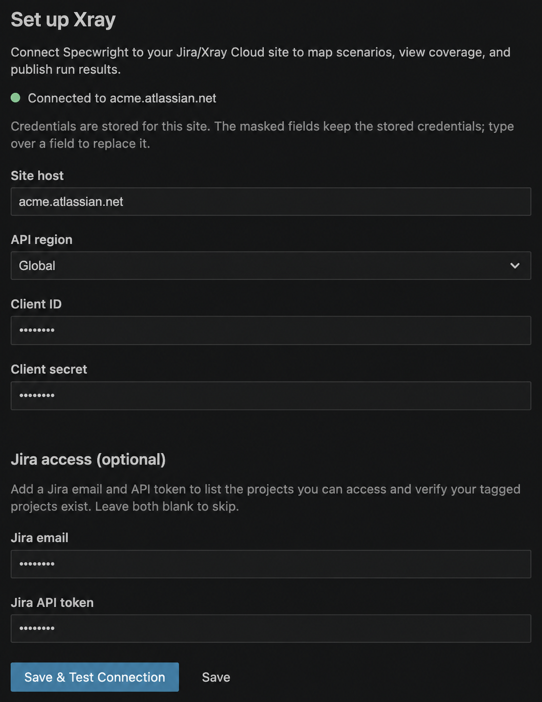
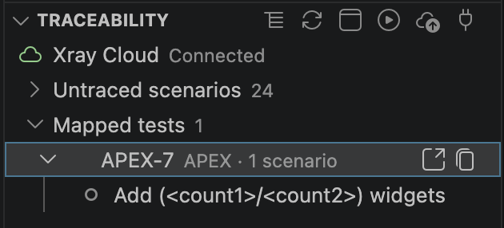
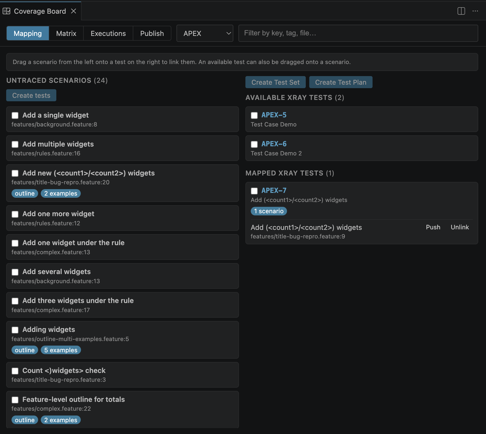
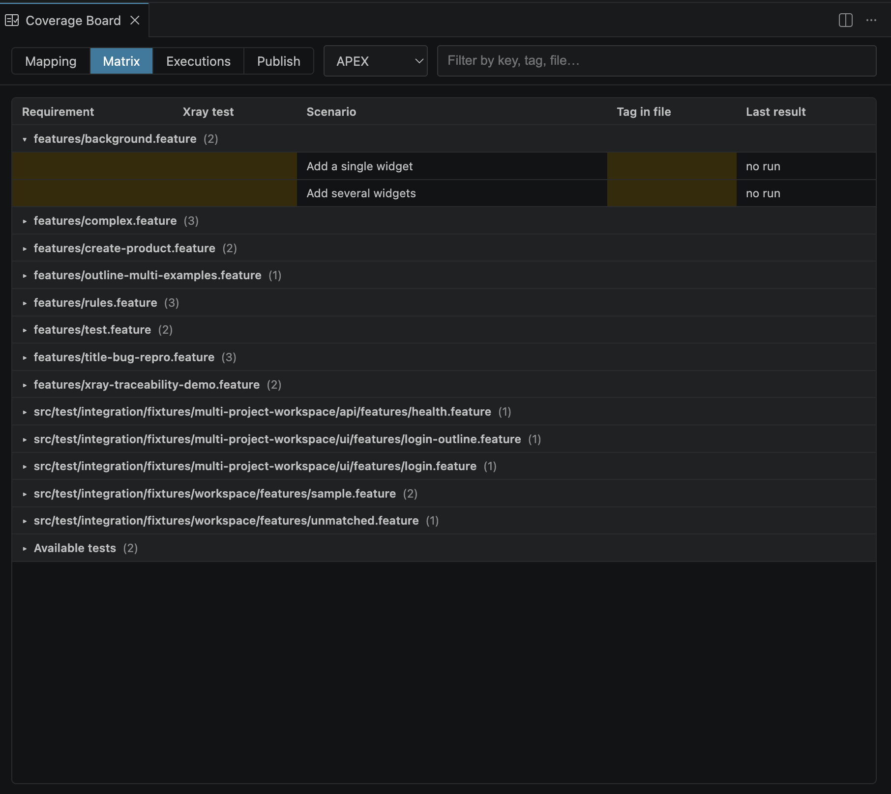
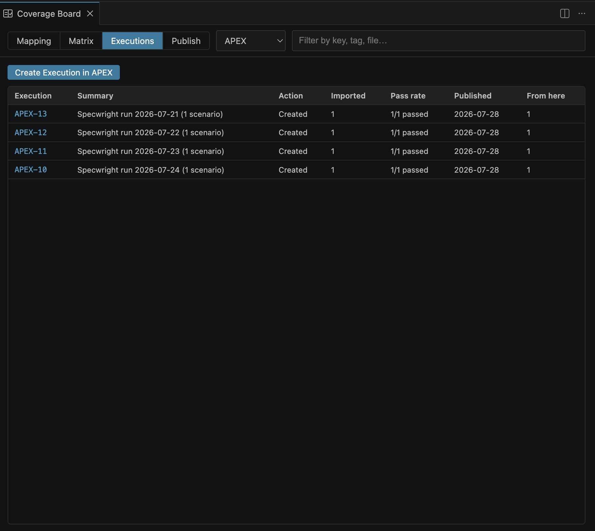
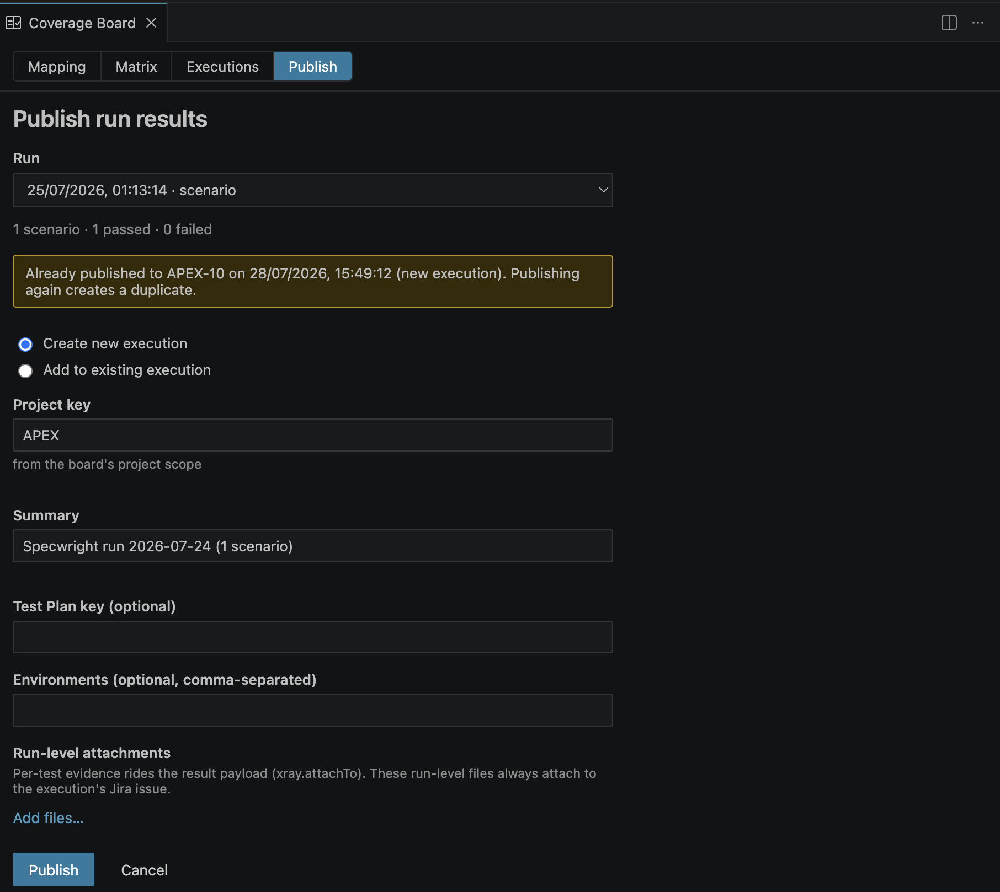

# Xray Cloud traceability

> **Experimental: Xray Cloud only.** Specwright can connect an existing `playwright-bdd` workspace to Xray Cloud from inside VS Code. It is suitable for trying the workflow with a Jira/Xray trial tenant, provided your account can access the project you use. Because some actions create or update remote records, use a disposable project for your first evaluation and review each confirmation carefully.

Traceability starts with tags in your `.feature` files. Specwright uses them to show mapped and untraced scenarios, sync Xray metadata, run your tests locally, and optionally publish their results. It does not run tests in Jira or Xray; tests always run through your local Playwright setup.

## Choose the right action

The guide labels actions by where their effects go.

| Action | Data boundary | What it does |
| --- | --- | --- |
| Review local mappings, change grouping, edit tags, or clear local run history | **Local only** | Changes VS Code state or your workspace files. It does not modify Xray or Jira. |
| Connect, test the connection, sync, search for a test, or load accessible projects | **Local storage + remote read** | Stores credentials in VS Code Secret Storage when connecting, then uses Xray Cloud and, where configured, Jira APIs without creating or updating records. |
| Link an existing test | **Local write** | Adds or removes an `@TEST_…` tag in the local `.feature` file. Searching for the test may read remote data, but the link itself does not change the remote test. |
| Create a test, push Gherkin text, create a Test Set, Test Plan, or Test Execution, publish results, or upload attachments | **Remote change** | Creates or updates Jira/Xray data after an explicit confirmation. |

## Before you begin

You need:

- An existing workspace with Specwright and `playwright-bdd` already configured. See [running tests](runs.md) if the project itself is not running yet.
- An Xray Cloud API client ID and client secret.
- Your Atlassian site host, such as `example.atlassian.net`, and the Xray API region for that site: `global`, `us`, `eu`, or `au`.
- Access to the Jira project you intend to read or change. The precise permissions depend on your Jira/Xray configuration.

Jira access is optional but recommended. Add a Jira email and API token when you want Specwright to list accessible projects, search existing executions or plans, or upload attachments to a Jira issue. Xray authentication still uses the Xray client ID and client secret; it does not use your Jira password.

Do not put either secret in `settings.json`, `.feature` files, screenshots, or source control. Specwright stores the Xray and optional Jira credential pairs in VS Code Secret Storage. **Disconnect from Xray** removes the stored pairs for the current site; it does not delete any remote tests, executions, or attachments.

## Connect to Xray

1. In the Command Palette, run **Specwright: Connect to Xray**. You can also select **Set up Xray** in the empty Traceability panel.
2. Enter the site host, Xray client ID, and client secret. Use a host such as `example.atlassian.net`; a scheme or trailing slash is normalized, but paths and ports are not valid.
3. Set `playwrightBddRunner.xray.apiRegion` to the region that matches your Xray Cloud tenant. The default is `global`.
4. Optionally enter both a Jira email and Jira API token. Leave both fields blank if you do not need Jira project discovery, target search, or issue attachments.
5. Choose **Save & Test Connection**.

The connection test authenticates with Xray and, when the workspace already contains test tags, probes their metadata. With Jira credentials, it can also show the projects your account can access. It does not create or update remote records.

Later, use **Specwright: Manage Xray Connection** to update credentials, test the connection, disconnect, or open the relevant settings.



## A safe first pass for a trial

You can evaluate the integration without creating any remote data:

1. Connect and test the connection.
2. Set a disposable project as the default project, or add it to `xray.syncProjectKeys`.
3. Add a tag for a known existing test, or open the Coverage Board and sync that project.
4. Link a scenario to an existing test. This writes only the local tag.
5. Run **Run Locally and Publish…**, inspect the local result summary, then cancel the Publish tab instead of choosing **Publish**.

At that point you have tested connection, mapping, local execution, and result capture. Move on to creating remote tests, executions, or attachments only when you are ready for those remote changes.

## Tag scenarios in your feature files

Use a test tag to map one executable Gherkin unit to an Xray test. Use a requirement tag when you want the Coverage Board's Matrix to show a local requirement-to-test-to-scenario relationship.

```gherkin
@TEST_DEMO-123 @REQ_DEMO-9
Scenario: A signed-in customer can place an order
  Given a signed-in customer
  When they place an order
  Then the order is confirmed
```

By default:

- `@TEST_DEMO-123` maps the scenario to the Xray test with key `DEMO-123`.
- `@REQ_DEMO-9` marks the scenario as covering the requirement key `DEMO-9`.

The prefixes are case-insensitive and keys are normalized to uppercase. A valid key has the usual Jira form, such as `DEMO-123`; project parts may contain letters, digits, underscores, or hyphens. The settings hold the prefix without `@`: use `TEST_`, not `@TEST_`.

### Keep mappings one-to-one

Put one test tag directly on the `Scenario`, `Scenario Outline`, or `Examples` block it represents. Specwright warns when one unit has multiple test tags, or when the same test tag is applied to more than one unit. Those mappings are ambiguous for publishing.

Feature-level test tags are inherited by every scenario in the feature. Avoid them unless the feature contains exactly one executable unit. Tags on `Rule:` and `Background:` are not used for traceability; place the tag on the scenario or Examples block instead.

For a Scenario Outline, an outline-level test tag maps the whole outline to one Xray test. A test tag on a particular `Examples:` block maps that block separately. Specwright does not create one Xray test per example row. See [Scenario Outlines in Xray](#scenario-outlines-in-xray) for how an outline is created, pushed, and published.

Changing a local tag updates the local mapping automatically. It does not require a remote sync and does not change Xray.

## Review mapping and sync remote data

Open the **Specwright** view in the Activity Bar, then open **Traceability**. The panel can group data by test or by feature file and shows:

- **Untraced scenarios:** local scenarios without a valid test tag.
- **Mapped tests:** local scenarios grouped by their Xray test key.
- **Available Xray tests:** synced tests in a catalogued project that no local scenario maps to.
- Local run badges, plus synced remote summaries and status where available.

The panel keeps the last synced snapshot locally. It does not continually poll Xray. When the cache reaches `playwrightBddRunner.xray.cacheTtlMinutes`, it is marked stale; it remains display-only until you run **Specwright: Sync Traceability** again.



Sync always looks up the test keys already referenced by your local tags. To also load a whole project catalogue, which is needed to show available or unmapped Xray tests, set one of these before syncing:

- `playwrightBddRunner.xray.defaultProjectKey`
- `playwrightBddRunner.xray.syncProjectKeys`
- A project selected in the Coverage Board

The Coverage Board can load a newly selected project automatically when connected, but **Sync Traceability** is the clearest way to refresh it on demand. A remote test is shown as available only after Specwright has completed that project's catalogue sync; an incomplete project catalogue never drives a claim that a test is unlinked. A successful direct lookup can still identify a tagged key that is missing remotely.

## Use the Coverage Board

Run **Specwright: Open Coverage Board** from the Command Palette or the Traceability panel toolbar. The board remains entirely inside VS Code.

| Tab | Purpose |
| --- | --- |
| **Mapping** | Link untraced scenarios to synced Xray tests, create tests from selected scenarios, create a Test Set or Test Plan from selected tests, push scenario text, and remove a local link. |
| **Matrix** | Review the requirement, test, scenario, tag, and latest local result relationships. Empty cells show coverage gaps. |
| **Executions** | Shows executions created or published from this workspace. It is a local activity ledger, not a complete list of executions in Jira. |
| **Publish** | Select a completed local run and create a new Test Execution or append results to an existing one. |

Use the project selector at the top of the board to narrow the view and to choose the target project for creation actions.







### Link an existing test

There are two local-linking workflows:

1. In **Mapping**, drag an untraced scenario onto an available or mapped test. You can also drag an available test onto an untraced scenario.
2. In the Traceability panel, select **Link Scenario to Test** on the scenario row. The picker can use synced tests and, when available, search Xray for a test.

Confirming an existing test inserts its `@TEST_…` tag into the local feature file. **Unlink** removes only that local test tag. Neither action edits the remote Xray test.

### Create tests and containers

These actions make remote changes and always ask for confirmation:

- **Create tests** creates one Xray Cucumber test for each selected untraced scenario. The scenario name and its current Gherkin are sent to Xray, then Specwright adds the returned test tag locally. See [Scenario Outlines in Xray](#scenario-outlines-in-xray) for what is left out of the text that is sent.
- **Create Test Set** and **Create Test Plan** create a remote container for the selected tests. The selected tests must have a synced remote issue ID, so run Sync first if the action says a test cannot be resolved.
- **Create Execution** creates an empty remote Test Execution in the selected project. It has no results until you publish a run to it later.

A cancelled or partially completed bulk create can leave tests that were already created in Xray. If Specwright cannot apply the matching local tag, the remote test still exists; link it manually from the feature file or the Coverage Board.

### Push local Gherkin to an existing Xray test

On a mapped scenario row in **Mapping**, choose **Push** to replace the remote test's Gherkin with the local scenario text.

This is a remote update. Before writing, Specwright reads the remote test again and compares it with the last synced or refreshed version it has recorded. It refuses to overwrite a remote change it has not seen. If it reports drift, run Sync, review the difference, and decide whether to push again.

Push is available only for a synced Gherkin-compatible Xray test with a remote issue ID. It is not available for an Examples-block-only mapping, because that mapping does not own a complete scenario body. Sync reads remote text into Specwright's cache; it never overwrites your local `.feature` file.

## Run locally and publish results

Use **Specwright: Run Locally and Publish…** from the Traceability panel, a mapped-scenario row, or the Command Palette. It runs the selected scenario or all mapped scenarios through your local Playwright configuration, then opens the Publish workflow.

Before running, Specwright checks for unmapped scenarios, invalid or duplicate mappings, and known incompatible Xray test types. You can repair a mapping, run all flagged scenarios locally, or exclude flagged scenarios from the batch. An explicitly excluded or unmapped result is not sent to Xray. If you choose **Run all locally** and later choose Publish, review the publishable-result summary carefully: a result that still has a usable test mapping can remain eligible for publishing. To guarantee a flagged result stays local, exclude it or cancel the batch.

Runs started from the Testing view are recorded too, not only the ones started from **Run Locally and Publish…**. Running at any level there records one run alongside the Traceability badges it updates: a single Examples row, a scenario, a feature node, a tag group, a multi-selection, or the whole view. Debug runs started from the Testing view are recorded on the same path. Specwright keeps the last 10 runs in the workspace and drops older ones.

The plain run commands do not record. A run started with CodeLens in the feature editor, from the editor or Explorer context menus, or from a Command Palette run command such as **Run All Tests** leaves no run to publish afterwards. The Testing view and **Run Locally and Publish…** are the two paths that record one.

Use **Specwright: Publish Last Run…** to return to a recorded run. Its dropdown offers the runs that can still be published, which means all of the following hold:

- The Traceability panel is enabled. Test keys are resolved from its mapping when the run starts, so with the panel off no run is ever publishable, and a tag added after a run does not apply to it. Run the scenarios again after tagging them.
- The run finished without being cancelled or cut short.
- At least one of its results maps to an Xray test and was not excluded during preflight.

What **Run Locally and Publish…** adds is the preflight above. It checks mappings before running and records your exclusions on the run, so its results reach the Publish tab already reconciled. A Testing view run carries no preflight decisions, so read its result summary in the Publish tab before you publish it.

In the **Publish** tab:

1. Select the run to publish in the **Run** dropdown.
2. Choose **Create new execution** or **Add to existing execution**.
3. For a new execution, provide a project key and summary; you can optionally add a Test Plan key and environments. For an existing execution, enter or search for its key.
4. Review the result summary and attachments, then choose **Publish**.



Creating a new execution imports results as a new Xray Test Execution. Appending imports results into the execution you selected. Publishing does not launch a remote test run.

To create a new Test Execution, the target Jira project must have an Xray-mapped, standard-level work type named **Test Execution**, unless you configured a different name with `playwrightBddRunner.xray.executionIssueType`. A subtask work type cannot hold a standalone execution.

### Evidence and report attachments

Specwright can capture Playwright evidence such as screenshots, traces, and videos from the local run. `playwrightBddRunner.xray.attachTo` controls where per-test evidence goes:

- `evidence`: embed it in the Xray result payload.
- `issue`: upload it to the execution's Jira issue.
- `both`: do both.

Jira credentials are required for issue uploads. If `issue` or `both` is selected without Jira credentials, Specwright falls back to embedding the evidence in the Xray payload and tells you that it did so.

`playwrightBddRunner.xray.reportGlob` suggests run-level report bundles, such as Playwright HTML reports and trace archives. Chosen run-level files always upload to the Jira execution issue after a successful result import, so they require Jira credentials. An attachment failure does not undo a successful import; use the retry action to upload only the pending files instead of importing results again.

Only attach material you are permitted to send to Xray or Jira. Test artifacts can contain screenshots, URLs, user data, or other sensitive information.

## Scenario Outlines in Xray

Specwright treats a Scenario Outline as one Xray test from creation through publishing. An outline is never converted into an Xray dataset or a parameterized test; it stays Gherkin text.

### Create a test from an outline

Creating a test from an outline, one at a time or in bulk, creates a single Cucumber-type Xray test. Its Gherkin definition holds the outline as written, including every Examples table and any tagged Examples block.

The text sent is the outline body: its keyword line through its last Examples row. Everything around that body stays behind, including the `Feature:` line, any `Rule:` header, Background steps, and the tag lines above the outline, so the `@TEST_…` tag is not part of the definition either. Trailing blank and comment-only lines are trimmed off the end.

The test as read in Jira is therefore the outline on its own. Keep context that a Jira reader needs inside the outline rather than in a Background.

### Push an outline

**Push** replaces the whole Gherkin definition of the mapped test with the current outline text, Examples tables included. It is a replacement, not a merge, so a row you deleted locally disappears from the remote test.

Push refuses to write when the remote test is not one it can safely rewrite. It refuses a test whose type Xray reports as Manual or Generic, so an existing Manual test's dataset is left alone. It refuses a link that points at an individual `Examples:` block instead of a whole outline, and a test with no synced baseline or no remote issue ID. It also refuses when the remote definition changed since the last sync; sync, review the difference, then decide whether to push.

### Publish example rows

The outline is published as one test in the execution, and the rows you ran appear inside its Xray test run. The shape depends on the publishing mode:

- **Add to existing execution** sends each row as an iteration of the test, carrying the row's status and duration.
- **Create new execution** sends each row as its own scenario entry in a Cucumber report, named `Outline name (row title)`, and Xray folds those entries into the same test run.

Either way the test run's status aggregates the rows, so one failing row fails the test run in Xray. Rows carry the row title Playwright reports, normally `Example #1`, `Example #2`, and so on. That title is the only row-specific data Xray receives, so the row's parameter values are not visible in the execution.

### Read the counts

The Testing view counts each Examples row as an individual test. Xray counts the outline as one test case. Run all five rows of a five-row outline and you see five tests locally and one test with five rows inside its Xray test run. Because you can also run a single Examples row, only the rows that ran are reported: run two of the five and the Xray test run holds those two. The two tools count different units of the same run.

## Settings reference

All settings use the `playwrightBddRunner.*` namespace. See the general [settings reference](settings.md) for where to edit VS Code settings.

| Setting | Default | Purpose |
| --- | --- | --- |
| `traceability.enablePanel` | `true` | Shows the Traceability panel and its local file watchers. |
| `traceability.provider` | `xray` | Selects the traceability backend. Xray Cloud is the only available value. |
| `traceability.testTagPrefix` | `TEST_` | Prefix used to recognise test tags, for example `@TEST_DEMO-123`. |
| `traceability.reqTagPrefix` | `REQ_` | Prefix used to recognise requirement tags, for example `@REQ_DEMO-9`. |
| `xray.siteUrl` | empty | Jira/Xray Cloud host used for setup, Jira access, and browser links. |
| `xray.apiRegion` | `global` | Xray API region: `global`, `us`, `eu`, or `au`. It must match your tenant. |
| `xray.syncProjectKeys` | `[]` | Project catalogues included in every manual sync. Use this when you want available-test coverage for known projects. |
| `xray.cacheTtlMinutes` | `15` | How long a synced snapshot is considered fresh. Stale data is not refreshed until Sync runs. |
| `xray.defaultProjectKey` | empty | Prefills new tests and executions and joins the sync scope. |
| `xray.executionIssueType` | `Test Execution` | Work type used when creating a new Test Execution. It must be a standard-level type. |
| `xray.reportGlob` | `playwright-report/**`, `test-results/**/*.zip` | Workspace globs used to suggest run-level report attachments. |
| `xray.attachTo` | `evidence` | Sends per-test evidence to the Xray payload, the Jira issue, or both. |

For example, a trial workspace that uses an Australian Xray region and one disposable project might use:

```jsonc
{
  "playwrightBddRunner.xray.apiRegion": "au",
  "playwrightBddRunner.xray.defaultProjectKey": "DEMO",
  "playwrightBddRunner.xray.syncProjectKeys": ["DEMO"],
  "playwrightBddRunner.xray.attachTo": "evidence"
}
```

Keep credentials out of this file. Enter them through **Connect to Xray** instead.

## Troubleshooting

| Symptom | What to check |
| --- | --- |
| The Traceability panel is missing | Confirm `playwrightBddRunner.traceability.enablePanel` is enabled, then open the **Specwright** Activity Bar view. |
| Connection test fails | Check the Xray client ID, client secret, site host, and `xray.apiRegion`. Use **Test Xray Connection** and open the **Specwright** output channel for the safe diagnostic details. |
| Jira projects do not appear | Add both a Jira email and API token in Xray setup, then confirm the token can list projects on that site. This does not prevent Xray-only sync. |
| No available Xray tests appear | Set a default or sync project, select that project in the Coverage Board, and run Sync. Available tests appear only after a complete catalogue sync for that project. |
| A tag does not map a scenario | Check the prefix, Jira-key shape, and tag location. Put it on the scenario, outline, or Examples block, not on a Rule or Background. The Problems panel flags duplicate mappings and can suggest a missing prefix; Traceability preflight identifies invalid test tags. |
| A mapped test says it is not found remotely | The key may be mistyped, belong to a different project or site, or name an issue that is not an Xray test. Sync again after correcting the tag or connection. |
| Preflight reports a duplicate or incompatible mapping | Use one test tag per scenario unit and one scenario unit per test. For publishing or Push, link a Gherkin-compatible Xray test. |
| Push is blocked by drift | Another person may have changed the remote Gherkin since the last sync. Sync, review the intended overwrite, then try again. Examples-block mappings cannot be pushed. |
| Publish has no local runs | Enable the Traceability panel first: with it off, no run is publishable. Then check that the scenarios carry a valid test tag, that you started the run from the Testing view or with **Run Locally and Publish…**, and that preflight did not exclude them, and run them again. Only the last 10 runs are kept, and **Clear Local Run History…** in the Command Palette empties them. |
| A new execution cannot be created | Check project permissions and the Xray Test Execution work-type mapping. If your project uses another standard-level name, set `xray.executionIssueType` to that name. |
| Attachments are unavailable or fail | Add Jira credentials for issue uploads, check the site's upload limit and file size, then use the pending-attachment retry. A successful result import is not repeated. |

## Trial cleanup

For a clean trial, run **Specwright: Clear Local Run History…** from the Command Palette, which is its only entry point, to remove this workspace's recorded local runs and, if you choose, its local publish ledger. This does not delete remote records.

Delete any trial Tests, Test Sets, Test Plans, Test Executions, and attachments through Jira/Xray using an account with permission to do so. When you are finished, use **Disconnect from Xray** to remove stored credentials from VS Code Secret Storage.

## Current boundaries

- Xray traceability is experimental and Xray Cloud only.
- Tags are the source of truth for the local mapping; Specwright does not infer a link from a scenario name.
- Remote metadata is cached; use Sync to refresh it on demand. The Coverage Board may load a newly selected project, but changes are never continuously imported.
- The Coverage Board's Executions tab shows activity recorded by this workspace, not every execution on the Jira site.
- Local Gherkin is never pushed automatically. Creating, pushing, publishing, and attaching files all require an explicit action and confirmation.

For feature-file authoring and ordinary test execution, see [authoring features](features.md) and [running and debugging tests](runs.md).
